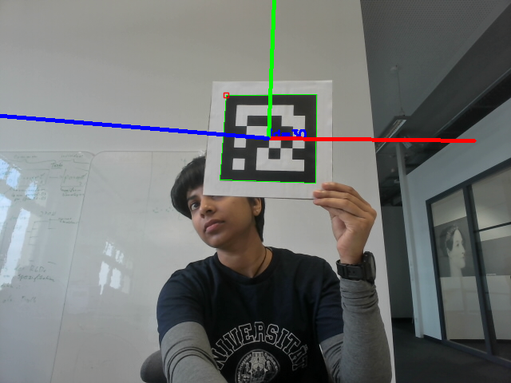

# ArUco Pose Detection and Estimation using OpenCV

## Installation
```bash
sudo apt install libopencv-dev
```

## Compile and Run
```bash
g++ -o ./compiled_files/poses 3_marker_posestimation.cpp `pkg-config --cflags --libs opencv4`
```
```bash
./compiled_files/poses
```
## Results


## Acknowledgements
OpenCV documentation: [ArUco Detection Tutorial](https://docs.opencv.org/3.4/d5/dae/tutorial_aruco_detection.html).